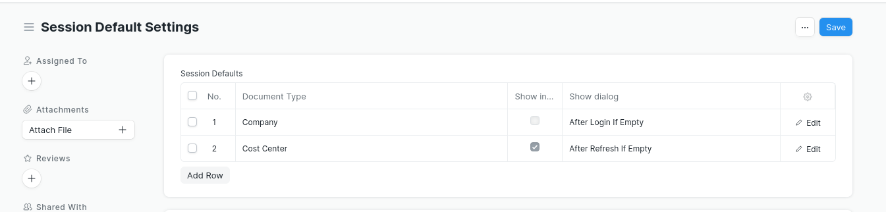
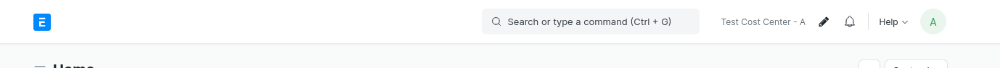

## Show Session

Show Default Session in navbar

1. 

> - to activate the tool, in `Session Default Settings` check **Show in Navbar** in one of **Session Defaults**

2. 

> - show session default of cost center on navbar.
> - click on text to open document.
> - click on pen to open session defaults dialog.

#### License

Apache License Version 2.0
